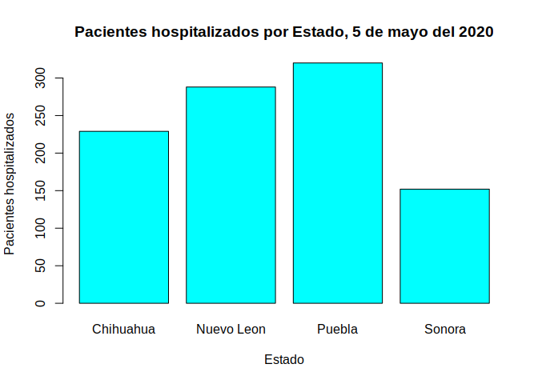

Examen de conocimientos de programación para la Maestría en Ciencia de Datos
============================================================================

Hugo de Jesús Valenzuela Chaparro
---------------------------------

Universidad de Sonora
---------------------

23 de junio del 2020
--------------------

Este documento y código es para el examen de conocimientos de
programación de la Maestría en Ciencia de Datos. Convocatoria 2020. Se
trabajará en analisis sobre COVID-19, la enfermedad causada por el nuevo
coronavirus SARS-CoV2, haciendo uso de los datos abiertos de la
Secretaria de Salud Federal con fecha de corte al 11 de mayo del 2020.

El lenguaje de programación utilizado es R en versión 3.6.3, haciendo
uso del entorno de desarrollo integrado (IDE) RStudio especificamente,
con versión 1.2.1335.

Importación y limpieza de los datos
-----------------------------------

Primeramente, importamos la base de datos (BD) cruda incluyendo todas
las columnas.

``` r
# guardar base de datos (BD) en un objeto de R
BD_raw<- read.csv("/home/hugo/examen-prog/covid-data/200511COVID19MEXICO.csv", header = TRUE, sep = ",")
# NOTA: la ruta del directorio de la BD cambiara dependiendo de donde se corra el codigo
```

### Sonora

Ahora, vamos a reducir la base de datos para quedarnos solamente con las
columnas de Fecha de actualización (de la BD), Fecha de inicio de
síntomas, Fecha de defunción, Estado de residencia y el Resultado a la
prueba de SARS-CoV2. Debe verse como la siguiente tabla

``` r
# columnas a extraer
columnas <- c("FECHA_ACTUALIZACION", "ENTIDAD_RES", "FECHA_SINTOMAS", "FECHA_DEF", "RESULTADO")
BD_1 <- subset(BD_raw, select = columnas) # se extraen las columnas

# imprimimos las primeras columnas de la BD resultante
head(BD_1)
```

    ##   FECHA_ACTUALIZACION ENTIDAD_RES FECHA_SINTOMAS  FECHA_DEF RESULTADO
    ## 1          2020-05-11          27     2020-03-29 9999-99-99         1
    ## 2          2020-05-11          25     2020-03-22 2020-03-29         1
    ## 3          2020-05-11          27     2020-03-18 2020-04-05         1
    ## 4          2020-05-11          25     2020-04-04 2020-04-20         1
    ## 5          2020-05-11          25     2020-04-02 2020-04-23         1
    ## 6          2020-05-11          25     2020-03-31 9999-99-99         1

Se nos pide una tabla de tres columnas: En específico para el Estado de
Sonora (clave 26).

Procedemos a hacer una filtración de la BD para tener las personas de
Sonora confirmadas con SARS-CoV2 por fecha de síntomas y que
lamentablemente fallecieron.

``` r
# usamos funcion subset para quedarnos con los fallecimientos de Sonora, con resultado de SARS-CoV2 positivo
BD_1 <- subset(BD_1, ENTIDAD_RES == 26 & RESULTADO == 1 & FECHA_DEF != "9999-99-99")
head(BD_1)
```

    ##      FECHA_ACTUALIZACION ENTIDAD_RES FECHA_SINTOMAS  FECHA_DEF RESULTADO
    ## 1138          2020-05-11          26     2020-04-09 2020-04-22         1
    ## 1643          2020-05-11          26     2020-04-08 2020-04-15         1
    ## 1752          2020-05-11          26     2020-03-30 2020-04-08         1
    ## 1814          2020-05-11          26     2020-03-20 2020-04-05         1
    ## 2186          2020-05-11          26     2020-04-13 2020-04-21         1
    ## 2819          2020-05-11          26     2020-04-14 2020-04-29         1

Nos quedamos ahora con las columnas fecha (de actualización),
confirmados de SARS-CoV2 por fecha de síntomas, decesos entre los
confirmados. Luego se exportan a una tabla en formato csv, llamada
Tabla1.

``` r
BD_tabla1 <- subset(BD_1, select = -c(ENTIDAD_RES, RESULTADO))
head(BD_tabla1)
```

    ##      FECHA_ACTUALIZACION FECHA_SINTOMAS  FECHA_DEF
    ## 1138          2020-05-11     2020-04-09 2020-04-22
    ## 1643          2020-05-11     2020-04-08 2020-04-15
    ## 1752          2020-05-11     2020-03-30 2020-04-08
    ## 1814          2020-05-11     2020-03-20 2020-04-05
    ## 2186          2020-05-11     2020-04-13 2020-04-21
    ## 2819          2020-05-11     2020-04-14 2020-04-29

``` r
# se exporta la tabla a archivo tabla1.csv
write.csv(BD_tabla1, file = "tabla1.csv", row.names = FALSE)
```

### Casos hospitalizados

Veamos ahora los casos hospitalizados en los Estados de Sonora,
Chihuahua, Nuevo León y Puebla, con claves 26, 8, 19 y 21,
respectivamente.

De manera similar al análisis anterior, ajustamos la base de datos y nos
quedamos con las columnas de Estado de residencia y con Tipo de paciente
la cual indica si está hospitalizado o no.

``` r
# se extraen las columnas
BD_2 <- subset(BD_raw, select = c(ENTIDAD_RES, TIPO_PACIENTE)) 
```

Filtramos para obtener solamente los 4 Estados mencionados anteriormente
con sus claves con los pacientes hospitalizados. Luego se imprime la
tabla a archivo externo csv, llamado tabla2.

``` r
# Usamos las claves de los estados 26, 8, 19, 21 y seleccionamos el numero 2 de la columna
# de tipo de paciente que indica que estan hospitalizados
BD_tabla2 <- subset(BD_2, ENTIDAD_RES == c(26,8,19,21) & TIPO_PACIENTE == 2)
# se exporta la tabla a csv
write.csv(BD_tabla2, file = "tabla2.csv", row.names = FALSE)
```

Gráficas
--------

Realicemos una gráfica de barras de la tabla 2, para veruna comparación
en el número de casos hospitalizados entre los 4 Estados. Esto se lleva
a cabo con la función barplot(), nativa de R.

``` r
# La tabla ya contiene solamente pacientes hospitalizados, entonces usamos la variable 
# de los Estados para hacer la grafica de barras verticales


Estados_Clav <- table(BD_tabla2$ENTIDAD_RES)
barplot(Estados_Clav, main="Pacientes hospitalizados por Estado, 5 de mayo del 2020",
   xlab="Estado", ylab = "Pacientes hospitalizados", col = "cyan",
   names.arg = c("Chihuahua", "Nuevo Leon", "Puebla", "Sonora")) 
```



Por último, graficaremos una serie de tiempo de los pacientes
confirmados con SARS-CoV2 a nivel nacional, de acuerdo a la fecha de
inicio de los síntomas. Primero creamos los vectores de R para graficar.

``` r
# se extraen las columnas de fecha de inicio de sintomas y resultado a SARS-CoV2
BD_nacional <- subset(BD_raw, select = c(FECHA_SINTOMAS, RESULTADO))
# nos quedamos solo con los casos confirmados positivos de SARS_CoV2
BD_nacional <- subset(BD_nacional, RESULTADO == 1)
# Se convierte la columna de fechas de sintomas, a fecha de formato R para poder graficar despues
BD_nacional$FECHA_SINTOMAS <- as.Date(BD_nacional$FECHA_SINTOMAS)

# Creamos un intervalo de fechas, desde la fecha más pronta de inicio de sintomas hasta el
# ultimo dia de actualizacion de la BD que es el 11 de mayo del 2020
```
